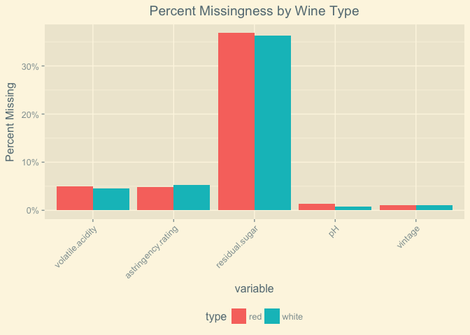
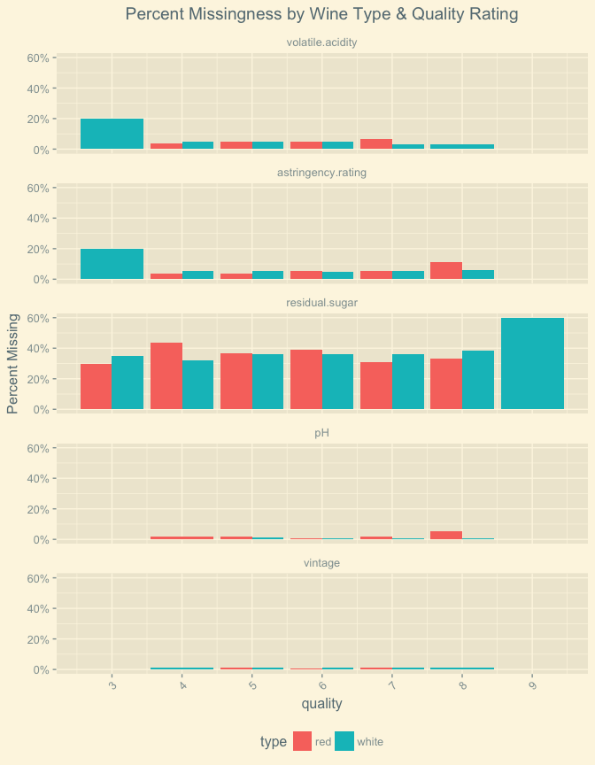

SAP.iO Data Science Challenge
================
Ki Ka
February 12, 2018

*What makes a wine 'good'?*
---------------------------

I love wine. I first fell in love with Grüner Veltliner. It screams summer. It makes you want to swim in the Danube, even in the winter. That doesn't mean that you should.

We're interested in what makes a good wine. Let's find out. On its face (or bottle's label?) this is a classification problem. Since we're interested in the *what* of wine quality, I'll avoid less interpretable models that might do quite well at predicting wine quality--like support vector machines or neural nets. I can see logistic regression/linear discriminant analysis, k-nearest neighbors, or some flavor of decision tree being useful.

Here's an outline to my approach in getting us from grape to glass--

-   Uncorking the data - exploratory analysis
    -   What measures do we have?
    -   What do they look like (distributions, missingness)
    -   How do they relate to each other (correlations)
-   Decanting the data - feature engineering
    -   Transformations and dimension reduction
    -   Imputation of missing values
    -   Target prep
-   See, sniff, & sip - modeling
    -   Logisitic regression
    -   CART
    -   KNN
-   Next pour - What I'd do if time were as plentiful as 2-buck-chuck

Uncorking the data
------------------

*each day now the cork more sweetly leaves the bottle* (Robert Lowell)

### What measures do we have?

I like to know the names of what we're working with:

``` r
names(sapWineTime)
```

    ##  [1] "type"                 "fixed.acidity"        "volatile.acidity"    
    ##  [4] "citric.acid"          "astringency.rating"   "residual.sugar"      
    ##  [7] "chlorides"            "free.sulfur.dioxide"  "total.sulfur.dioxide"
    ## [10] "density"              "pH"                   "sulphates"           
    ## [13] "alcohol"              "vintage"              "quality"

And their basic summary stats:

``` r
summary(sapWineTime)
```

    ##     type      fixed.acidity    volatile.acidity  citric.acid    
    ##  red  :1599   Min.   : 3.800   Min.   :0.0800   Min.   :0.0000  
    ##  white:4898   1st Qu.: 6.400   1st Qu.:0.2300   1st Qu.:0.2500  
    ##               Median : 7.000   Median :0.2900   Median :0.3100  
    ##               Mean   : 7.215   Mean   :0.3391   Mean   :0.3186  
    ##               3rd Qu.: 7.700   3rd Qu.:0.4000   3rd Qu.:0.3900  
    ##               Max.   :15.900   Max.   :1.5800   Max.   :1.6600  
    ##                                NA's   :299                      
    ##  astringency.rating residual.sugar     chlorides       free.sulfur.dioxide
    ##  Min.   :0.410      Min.   : 0.600   Min.   :0.00900   Min.   :  1.00     
    ##  1st Qu.:0.670      1st Qu.: 1.800   1st Qu.:0.03800   1st Qu.: 17.00     
    ##  Median :0.730      Median : 3.000   Median :0.04700   Median : 29.00     
    ##  Mean   :0.751      Mean   : 5.459   Mean   :0.05603   Mean   : 30.53     
    ##  3rd Qu.:0.800      3rd Qu.: 8.100   3rd Qu.:0.06500   3rd Qu.: 41.00     
    ##  Max.   :1.620      Max.   :65.800   Max.   :0.61100   Max.   :289.00     
    ##  NA's   :332        NA's   :2364                                          
    ##  total.sulfur.dioxide    density             pH          sulphates     
    ##  Min.   :  6.0        Min.   :0.9871   Min.   :2.720   Min.   :0.2200  
    ##  1st Qu.: 77.0        1st Qu.:0.9923   1st Qu.:3.110   1st Qu.:0.4300  
    ##  Median :118.0        Median :0.9949   Median :3.210   Median :0.5100  
    ##  Mean   :115.7        Mean   :0.9947   Mean   :3.218   Mean   :0.5313  
    ##  3rd Qu.:156.0        3rd Qu.:0.9970   3rd Qu.:3.320   3rd Qu.:0.6000  
    ##  Max.   :440.0        Max.   :1.0390   Max.   :4.010   Max.   :2.0000  
    ##                                        NA's   :62                      
    ##     alcohol         vintage        quality     
    ##  Min.   : 8.00   Min.   :2001   Min.   :3.000  
    ##  1st Qu.: 9.50   1st Qu.:2004   1st Qu.:5.000  
    ##  Median :10.30   Median :2005   Median :6.000  
    ##  Mean   :10.49   Mean   :2005   Mean   :5.818  
    ##  3rd Qu.:11.30   3rd Qu.:2007   3rd Qu.:6.000  
    ##  Max.   :14.90   Max.   :2008   Max.   :9.000  
    ##                  NA's   :69

### What do these measures look like?

#### Distributions

Let's take a look at the distribution of our continuous variables. I identify the continuous variables as those measures with more than 10 unique levels.

``` r
for (i in names(sapWineTime[,(apply(sapWineTime, 2, function(x) length(unique(x))) > 10)])) {
  print(i)
  plot <- ggplot(sapWineTime, 
                 aes(get(i), fill = type)) +
            geom_histogram() +
            theme_solarized_2() +
            theme(plot.title = element_text(hjust = 0.5), 
                  legend.position = 'bottom') +
            labs(x = paste(i), 
                 title = paste('Distribution of ', i)) +
            facet_wrap(~type)
  print(plot)
}
```

    ## [1] "fixed.acidity"


    ## [1] "volatile.acidity"


    ## [1] "citric.acid"


    ## [1] "astringency.rating"


    ## [1] "residual.sugar"


    ## [1] "chlorides"


    ## [1] "free.sulfur.dioxide"


    ## [1] "total.sulfur.dioxide"


    ## [1] "density"


    ## [1] "pH"


    ## [1] "sulphates"


    ## [1] "alcohol"


These distributions don't look too worrisome. Some make complete sense. In my time working behind a bar and learning about the production of wine, the right-skewed distributions of `citric.acid`, `free.sulfur.dioxide`, and `total.sulfur.dioxide` in red wines and `residual.sugar` in both red and white wines make contextual sense. I can taste some of the `residual.sugar` outliers, maybe some Sauternes or Rieslings...

#### Missingness

Missingness is always an issue with real data. Hopefully it's missing at random. I'm primarily interested in whether missing data is related at all with wine type or quality scores. Let's do a few things to quickly explore whether missingness is in fact random:

-   Examine overall counts of missing values by type and type + quality
-   Visual inspection
-   Look at t-tests of missingness by type, ANOVA results of missingess by quality rating, and ANOVA results of missigness by type and quality rating

``` r
# here i'm creating a summary data frame aggregated to the type and type+quality-level 
# with a count of missing values and proportion of observations with missing values
# for each of the physiochemical variables

# type-level missingness
#

sapWineTimeMissOverall <- data.frame(aggregate(. ~ type, data = sapWineTime, 
                     function(x) {sum(is.na(x))/length(x)},
                     na.action = NULL))

sapWineTimeMissOverall <- melt(sapWineTimeMissOverall,
                               id.vars = 'type',
                               value.name = 'percMissing')

sapWineTimeMissOverall <- sapWineTimeMissOverall %>%
  filter(percMissing > 0)

# type+quality-level missingness
#

sapWineTimeMiss <- data.frame(aggregate(. ~ type + quality, 
                                        data = sapWineTime, 
                                        function(x) {sum(is.na(x))/length(x)}, 
                                        na.action = NULL))

sapWineTimeMiss <- melt(sapWineTimeMiss, 
                        id.vars = c('type', 'quality'), 
                        value.name = 'percMissing')

sapWineTimeMiss <- cbind(sapWineTimeMiss, 
                  melt(aggregate(. ~ type + quality, 
                                 data = sapWineTime, 
                                 function(x) {sum(is.na(x))}, 
                                 na.action = NULL),
                       id.vars = c('type', 'quality'), 
                       value.name = 'countMissing')[4])

sapWineTimeMiss <- sapWineTimeMiss %>%
  filter(countMissing > 0)

# creating plot object using the data frames created above
#

missTypePlot <- 
  ggplot(sapWineTimeMissOverall, 
         aes(x = variable, y = percMissing, fill = type)) +
  geom_bar(stat = 'identity', 
           position = 'dodge') +
  scale_y_continuous(labels = scales::percent) + 
  labs(title = 'Percent Missingness by Wine Type', 
       y = 'Percent Missing') +
  theme_solarized_2() +
  theme(legend.position = 'bottom', 
        axis.text.x = element_text(angle = 45, hjust = 1), 
        plot.title = element_text(hjust = 0.5))

missTypeQualMissPlot <- 
  ggplot(sapWineTimeMiss, 
         aes(x = quality, y = percMissing, fill = type)) +
  geom_bar(stat = 'identity', 
           position = 'dodge') +
  scale_y_continuous(labels = scales::percent) + 
  scale_x_continuous(breaks = seq(3, 9, 1)) +
  labs(title = 'Percent Missingness by Wine Type & Quality Rating', 
       y = 'Percent Missing') +
  facet_wrap(~variable, 
             ncol = 1) + 
  theme_solarized_2() +
  theme(legend.position = 'bottom', 
        axis.text.x = element_text(angle = 45, hjust = 1), 
        plot.title = element_text(hjust = 0.5))
```

``` r
missTypePlot
```



``` r
missTypeQualMissPlot
```



For the most part, it looks like variables are missing at random when we stratify by wine type and quality scores. There are a couple of worrisome spots, like the proportion of 3-star white wines missing `volatile.acidity` and `astringency.rating`, or 9-star white wines missing `residual.sugar`, but those cells are relatively small and we can likely combine them with other star ratings when we get to classification models.

The more concerning issue is the proportion of observations that are missing `residual.sugar` (~36% of all observations). We have a few choices about how to deal with this: (1) impute the missing values, (2) drop the feature from any modeling, (3) buy the 2,364 bottles with missing values and measure `residual.sugar` ourselves. I like that idea.

Before we decide anything, let's just take a quick look at whether missingness is occurring at random:

``` r
# testing for missingness at random by creating a sparse matrix of indicators for (not) missingness
# and binding type and quality in order to run some t-tests and anovas
#

sapWineTimeMAR <- cbind(sapWineTime[, c('type', 'quality')], 
              sapply(sapWineTime[, as.character(unique(sapWineTimeMiss$variable))], 
                     function(x) ifelse(is.na(x), 1, 0)))

for (i in names(sapWineTimeMAR[ , 3:dim(sapWineTimeMAR)[2]])) {
  print(paste('******************  ', i, '  ******************'))
  print(paste('t-test p-value :', t.test(get(i) ~ type, data = sapWineTimeMAR)$p.value))
  print(summary(aov(get(i) ~ quality, data = sapWineTimeMAR)))
  print(summary(aov(get(i) ~ type*quality, data = sapWineTimeMAR)))
}
```

    ## [1] "******************   volatile.acidity   ******************"
    ## [1] "t-test p-value : 0.467368526620972"
    ##               Df Sum Sq Mean Sq F value Pr(>F)
    ## quality        1   0.11  0.1133   2.582  0.108
    ## Residuals   6495 285.13  0.0439               
    ##                Df Sum Sq Mean Sq F value Pr(>F)
    ## type            1   0.02 0.02430   0.554  0.457
    ## quality         1   0.10 0.10262   2.338  0.126
    ## type:quality    1   0.11 0.11083   2.525  0.112
    ## Residuals    6493 285.00 0.04389               
    ## [1] "******************   astringency.rating   ******************"
    ## [1] "t-test p-value : 0.530357469563102"
    ##               Df Sum Sq Mean Sq F value Pr(>F)
    ## quality        1      0 0.00107   0.022  0.882
    ## Residuals   6495    315 0.04850               
    ##                Df Sum Sq Mean Sq F value Pr(>F)  
    ## type            1   0.02 0.01840   0.379 0.5379  
    ## quality         1   0.00 0.00028   0.006 0.9399  
    ## type:quality    1   0.17 0.16925   3.490 0.0618 .
    ## Residuals    6493 314.85 0.04849                 
    ## ---
    ## Signif. codes:  0 '***' 0.001 '**' 0.01 '*' 0.05 '.' 0.1 ' ' 1
    ## [1] "******************   residual.sugar   ******************"
    ## [1] "t-test p-value : 0.667650024775958"
    ##               Df Sum Sq Mean Sq F value Pr(>F)
    ## quality        1      0 0.01092   0.047  0.828
    ## Residuals   6495   1504 0.23154               
    ##                Df Sum Sq Mean Sq F value Pr(>F)
    ## type            1    0.0  0.0429   0.185  0.667
    ## quality         1    0.0  0.0169   0.073  0.787
    ## type:quality    1    0.3  0.3345   1.444  0.229
    ## Residuals    6493 1503.4  0.2315               
    ## [1] "******************   pH   ******************"
    ## [1] "t-test p-value : 0.128430040544234"
    ##               Df Sum Sq  Mean Sq F value Pr(>F)
    ## quality        1   0.01 0.009169    0.97  0.325
    ## Residuals   6495  61.40 0.009453               
    ##                Df Sum Sq  Mean Sq F value Pr(>F)  
    ## type            1   0.03 0.027341   2.893  0.089 .
    ## quality         1   0.01 0.005863   0.620  0.431  
    ## type:quality    1   0.00 0.003889   0.411  0.521  
    ## Residuals    6493  61.37 0.009452                 
    ## ---
    ## Signif. codes:  0 '***' 0.001 '**' 0.01 '*' 0.05 '.' 0.1 ' ' 1
    ## [1] "******************   vintage   ******************"
    ## [1] "t-test p-value : 0.995931142411669"
    ##               Df Sum Sq  Mean Sq F value Pr(>F)
    ## quality        1   0.00 0.000474   0.045  0.832
    ## Residuals   6495  68.27 0.010511               
    ##                Df Sum Sq  Mean Sq F value Pr(>F)
    ## type            1   0.00 0.000000   0.000  0.996
    ## quality         1   0.00 0.000483   0.046  0.830
    ## type:quality    1   0.00 0.000024   0.002  0.962
    ## Residuals    6493  68.27 0.010514

It looks like values are missing at random. For the sake of time, we're going to either drop `residual.sugar` from analyses (if it's highly correlated with another variable) or coerce it to be a categorical variable and introduce a "missing" category.

### How do measures relate?

I have a very strong suspicion that the physiochemical characteristics of wine are correlated and these correlations differ by wine type. I'll take a visual approach in assessing these correlations. This will help me do three things:

1.  What measures seem to be related with quality?
2.  Do some measures tell me the same information?
3.  Is there a reasonable (and preliminary) case to stratify my analyses by wine type?

#### Plotting correlations

I plot correlations by creating correlation matrices, shaping them into easily plottable (tidy) data frames, and using those data frames to create tile heat maps.

``` r
# creating correlation matrices from data, dropping type as i'll create separate matrices for red and white wines
wineCorMat <- round(cor(select(sapWineTime, -type), 
                        use = 'na.or.complete'),
                    2)
wineCorMatWhite <- round(cor(split(select(sapWineTime, -type), 
                                   sapWineTime$type)$white, 
                             use = 'na.or.complete'),
                         2)
wineCorMatRed <- round(cor(split(select(sapWineTime, -type), 
                                 sapWineTime$type)$red, 
                           use = 'na.or.complete'),
                       2)

# reducing information redundancy for the purposes of creating a clean plot later on

wineCorMat[lower.tri(wineCorMat)] <- NA
wineCorMatWhite[lower.tri(wineCorMatWhite)] <- NA
wineCorMatRed[lower.tri(wineCorMatRed)] <- NA


# creating tidy data frames to for easy plotting and creating a data frame that's the difference between red and white wine correlations

wineCorMatMelt <- melt(wineCorMat, na.rm = TRUE)
wineCorMatWhiteMelt <- melt(wineCorMatWhite, na.rm = TRUE)
wineCorMatRedMelt <- melt(wineCorMatRed, na.rm = TRUE)
wineCorMatDiff <- data.frame(wineCorMatMelt[, 1:2], 
                             value = abs(wineCorMatWhiteMelt[, 3] - wineCorMatRedMelt[, 3]))

ggplot(data = wineCorMatMelt, 
       aes(x = Var1, y = Var2, fill = value)) +
  geom_tile() +
  theme_solarized_2() +
  theme(legend.position = 'bottom', 
        axis.text.x = element_text(angle = 45, hjust = 1), 
        plot.title = element_text(hjust = 0.5)) +
  labs(title = 'All Wines - Correlation Matrix') +
  scale_fill_gradient2_tableau(palette = 'Temperature')
```

    ## Warning: Non Lab interpolation is deprecated


``` r
ggplot(data = wineCorMatWhiteMelt, 
       aes(x = Var1, y = Var2, fill = value)) +
  geom_tile() +
  theme_solarized_2() +
  theme(legend.position = 'bottom', 
        axis.text.x = element_text(angle = 45, hjust = 1), 
        plot.title = element_text(hjust = 0.5)) +
  labs(title = 'White Wines - Correlation Matrix') +
  scale_fill_gradient2_tableau(palette = 'Temperature')
```

    ## Warning: Non Lab interpolation is deprecated


``` r
ggplot(data = wineCorMatRedMelt, 
       aes(x = Var1, y = Var2, fill = value)) +
  geom_tile() +
  theme_solarized_2() +
  theme(legend.position = 'bottom', 
        axis.text.x = element_text(angle = 45, hjust = 1), 
        plot.title = element_text(hjust = 0.5)) +
  labs(title = 'Red Wines - Correlation Matrix') +
  scale_fill_gradient2_tableau(palette = 'Temperature')
```

    ## Warning: Non Lab interpolation is deprecated


``` r
ggplot(data = wineCorMatDiff, 
       aes(x = Var1, y = Var2, fill = value)) +
  geom_tile() +
  theme_solarized_2() +
  theme(legend.position = 'bottom', 
        axis.text.x = element_text(angle = 45, hjust = 1),
        plot.title = element_text(hjust = 0.5)) +
  labs(title = 'Difference Between White and Red Wine Correlation Coefficients') +
  scale_fill_gradient2_tableau(palette = 'Temperature')
```

    ## Warning: Non Lab interpolation is deprecated


#### Interpreting correlations

Three correlations jump out when looking at wine overall:

-   `fixed.acidity`-`astringency.rating` (r = 0.99)
-   `free.sulfur.dioxide`-`total.sulfur.dioxide` (r = 0.73)
-   `density`-`alcohol` (r = -0.67)

Looking at white wines only:

-   `fixed.acidity`-`astringency.rating` (r = 0.99)
-   `residual.sugar`-`density` (r = 0.85)
-   `density`-`alcohol` (r = -0.76)
-   `free.sulfur.dioxide`-`total.sulfur.dioxide` (r = 0.62)

And red wines:

-   `fixed.acidity`-`astringency.rating` (r = 0.99)
-   `fixed.acidity`-`citric.acid` (r = 0.68)
-   `free.sulfur.dioxide`-`total.sulfur.dioxide` (r = 0.68)
-   `astringency.rating`-`density` (r = 0.68)
-   `fixed.acidity`-`pH` (r = -0.68)
-   `astringency.rating`-`pH` (r = -0.67)
-   `fixed.acidity`-`density` (r = 0.66)
-   `citric.acidity`-`astringency.rating` (r = 0.63)

For the purposes of a prelimary model, I think there is evidence to run separate models for white and red wines.

### Decanting the data

#### Target prep

sapWineTimeRed %&gt;% group\_by

### See, Sniff, and Sip - Modeling

We'll fit a random forest

### 

``` r
set.seed(1786)
sapWineTimeWhite <- (split(sapWineTime, f = sapWineTime$type))$white
sapWineTimeRed <- (split(sapWineTime, f = sapWineTime$type))$red
```

#### All wines

``` r
# dropping highly correlated variables 
#

sapWineTimeModel <- sapWineTime %>%
  select(-residual.sugar, -type, -fixed.acidity) %>%
  na.omit()

# creating training & testing data sets (70/30 split)
#

sapWineTimeModelIndex <- sample.split(row.names(sapWineTimeModel), SplitRatio = .7)
sapWineTimeTrain <- sapWineTimeModel[sapWineTimeModelIndex, ]
sapWineTimeTest <- sapWineTimeModel[!sapWineTimeModelIndex, ]

# fitting a random forest model 
#

model <- 
  train(quality ~ .,
        tuneGrid = data.frame(mtry = c(2, 4, 6, 8)),
        data = sapWineTimeTrain, 
        method = 'rf',
        preProcess = c('scale', 'center'), 
        trControl = trainControl(method = "cv", number = 5, verboseIter = TRUE),
        importance = TRUE
)
```

    ## randomForest 4.6-12

    ## Type rfNews() to see new features/changes/bug fixes.

    ## 
    ## Attaching package: 'randomForest'

    ## The following object is masked from 'package:ranger':
    ## 
    ##     importance

    ## The following object is masked from 'package:dplyr':
    ## 
    ##     combine

    ## The following object is masked from 'package:ggplot2':
    ## 
    ##     margin

    ## + Fold1: mtry=2 
    ## - Fold1: mtry=2 
    ## + Fold1: mtry=4 
    ## - Fold1: mtry=4 
    ## + Fold1: mtry=6 
    ## - Fold1: mtry=6 
    ## + Fold1: mtry=8 
    ## - Fold1: mtry=8 
    ## + Fold2: mtry=2 
    ## - Fold2: mtry=2 
    ## + Fold2: mtry=4 
    ## - Fold2: mtry=4 
    ## + Fold2: mtry=6 
    ## - Fold2: mtry=6 
    ## + Fold2: mtry=8 
    ## - Fold2: mtry=8 
    ## + Fold3: mtry=2 
    ## - Fold3: mtry=2 
    ## + Fold3: mtry=4 
    ## - Fold3: mtry=4 
    ## + Fold3: mtry=6 
    ## - Fold3: mtry=6 
    ## + Fold3: mtry=8 
    ## - Fold3: mtry=8 
    ## + Fold4: mtry=2 
    ## - Fold4: mtry=2 
    ## + Fold4: mtry=4 
    ## - Fold4: mtry=4 
    ## + Fold4: mtry=6 
    ## - Fold4: mtry=6 
    ## + Fold4: mtry=8 
    ## - Fold4: mtry=8 
    ## + Fold5: mtry=2 
    ## - Fold5: mtry=2 
    ## + Fold5: mtry=4 
    ## - Fold5: mtry=4 
    ## + Fold5: mtry=6 
    ## - Fold5: mtry=6 
    ## + Fold5: mtry=8 
    ## - Fold5: mtry=8 
    ## Aggregating results
    ## Selecting tuning parameters
    ## Fitting mtry = 4 on full training set

``` r
# taking a look at the results
#

plot(model)
```


``` r
varImp(model$finalModel)
```

    ##                        Overall
    ## volatile.acidity     75.285830
    ## citric.acid          46.623193
    ## astringency.rating   37.556885
    ## chlorides            44.090272
    ## free.sulfur.dioxide  65.870229
    ## total.sulfur.dioxide 45.822371
    ## density              39.106346
    ## pH                   48.683081
    ## sulphates            59.571917
    ## alcohol              87.388281
    ## vintage               2.621625

``` r
varImpPlot(model$finalModel)
```


``` r
predQualTest <- data.frame(obs = sapWineTimeTest$quality, 
                                pred = predict(model, sapWineTimeTest))
defaultSummary(predQualTest)
```

    ##      RMSE  Rsquared       MAE 
    ## 0.5869315 0.5281959 0.4424943

#### White Wines

``` r
# dropping highly correlated variables 
#

sapWineTimeWhiteModel <- sapWineTimeWhite %>%
  select(-residual.sugar, -type, -fixed.acidity) %>%
  na.omit()

# creating training & testing data sets (70/30 split)
#

sapWineTimeWhiteModelIndex <- sample.split(row.names(sapWineTimeWhiteModel), SplitRatio = .7)
sapWineTimeWhiteTrain <- sapWineTimeWhiteModel[sapWineTimeWhiteModelIndex, ]
sapWineTimeWhiteTest <- sapWineTimeWhiteModel[!sapWineTimeWhiteModelIndex, ]

# fitting a random forest model 
#

modelWhite <- 
  train(quality ~ .,
        tuneGrid = data.frame(mtry = c(2, 4, 6, 8)),
        data = sapWineTimeWhiteTrain, 
        method = 'rf',
        preProcess = c('scale', 'center'), 
        trControl = trainControl(method = "cv", number = 5, verboseIter = TRUE),
        importance = TRUE
)
```

    ## + Fold1: mtry=2 
    ## - Fold1: mtry=2 
    ## + Fold1: mtry=4 
    ## - Fold1: mtry=4 
    ## + Fold1: mtry=6 
    ## - Fold1: mtry=6 
    ## + Fold1: mtry=8 
    ## - Fold1: mtry=8 
    ## + Fold2: mtry=2 
    ## - Fold2: mtry=2 
    ## + Fold2: mtry=4 
    ## - Fold2: mtry=4 
    ## + Fold2: mtry=6 
    ## - Fold2: mtry=6 
    ## + Fold2: mtry=8 
    ## - Fold2: mtry=8 
    ## + Fold3: mtry=2 
    ## - Fold3: mtry=2 
    ## + Fold3: mtry=4 
    ## - Fold3: mtry=4 
    ## + Fold3: mtry=6 
    ## - Fold3: mtry=6 
    ## + Fold3: mtry=8 
    ## - Fold3: mtry=8 
    ## + Fold4: mtry=2 
    ## - Fold4: mtry=2 
    ## + Fold4: mtry=4 
    ## - Fold4: mtry=4 
    ## + Fold4: mtry=6 
    ## - Fold4: mtry=6 
    ## + Fold4: mtry=8 
    ## - Fold4: mtry=8 
    ## + Fold5: mtry=2 
    ## - Fold5: mtry=2 
    ## + Fold5: mtry=4 
    ## - Fold5: mtry=4 
    ## + Fold5: mtry=6 
    ## - Fold5: mtry=6 
    ## + Fold5: mtry=8 
    ## - Fold5: mtry=8 
    ## Aggregating results
    ## Selecting tuning parameters
    ## Fitting mtry = 4 on full training set

``` r
# taking a look at the results
#

plot(modelWhite)
```


``` r
varImp(modelWhite$finalModel)
```

    ##                        Overall
    ## volatile.acidity     80.229141
    ## citric.acid          42.563542
    ## astringency.rating   34.881434
    ## chlorides            39.867191
    ## free.sulfur.dioxide  60.713424
    ## total.sulfur.dioxide 41.675093
    ## density              43.551273
    ## pH                   39.062838
    ## sulphates            32.156734
    ## alcohol              72.177239
    ## vintage              -1.064142

``` r
varImpPlot(modelWhite$finalModel)
```


``` r
predWhiteQualTest <- data.frame(obs = sapWineTimeWhiteTest$quality, 
                                pred = predict(modelWhite, sapWineTimeWhiteTest))
defaultSummary(predWhiteQualTest)
```

    ##      RMSE  Rsquared       MAE 
    ## 0.6212310 0.4907877 0.4677993

#### Red Wines

``` r
# dropping highly correlated variables 
#

sapWineTimeRedModel <- sapWineTimeRed %>%
  select(-residual.sugar, -type, -fixed.acidity) %>%
  na.omit()

# creating training & testing data sets (70/30 split)
#

sapWineTimeRedModelIndex <- sample.split(row.names(sapWineTimeRedModel), SplitRatio = .7)
sapWineTimeRedTrain <- sapWineTimeRedModel[sapWineTimeRedModelIndex, ]
sapWineTimeRedTest <- sapWineTimeRedModel[!sapWineTimeRedModelIndex, ]

# fitting a random forest model 
#

modelRed <- 
  train(quality ~ .,
        tuneGrid = data.frame(mtry = c(2, 4, 6, 8)),
        data = sapWineTimeRedTrain, 
        method = 'rf',
        preProcess = c('scale', 'center'), 
        trControl = trainControl(method = "cv", number = 5, verboseIter = TRUE),
        importance = TRUE
)
```

    ## + Fold1: mtry=2 
    ## - Fold1: mtry=2 
    ## + Fold1: mtry=4 
    ## - Fold1: mtry=4 
    ## + Fold1: mtry=6 
    ## - Fold1: mtry=6 
    ## + Fold1: mtry=8 
    ## - Fold1: mtry=8 
    ## + Fold2: mtry=2 
    ## - Fold2: mtry=2 
    ## + Fold2: mtry=4 
    ## - Fold2: mtry=4 
    ## + Fold2: mtry=6 
    ## - Fold2: mtry=6 
    ## + Fold2: mtry=8 
    ## - Fold2: mtry=8 
    ## + Fold3: mtry=2 
    ## - Fold3: mtry=2 
    ## + Fold3: mtry=4 
    ## - Fold3: mtry=4 
    ## + Fold3: mtry=6 
    ## - Fold3: mtry=6 
    ## + Fold3: mtry=8 
    ## - Fold3: mtry=8 
    ## + Fold4: mtry=2 
    ## - Fold4: mtry=2 
    ## + Fold4: mtry=4 
    ## - Fold4: mtry=4 
    ## + Fold4: mtry=6 
    ## - Fold4: mtry=6 
    ## + Fold4: mtry=8 
    ## - Fold4: mtry=8 
    ## + Fold5: mtry=2 
    ## - Fold5: mtry=2 
    ## + Fold5: mtry=4 
    ## - Fold5: mtry=4 
    ## + Fold5: mtry=6 
    ## - Fold5: mtry=6 
    ## + Fold5: mtry=8 
    ## - Fold5: mtry=8 
    ## Aggregating results
    ## Selecting tuning parameters
    ## Fitting mtry = 4 on full training set

``` r
# taking a look at the results
#

plot(modelRed)
```


``` r
varImp(modelRed$finalModel)
```

    ##                         Overall
    ## volatile.acidity     31.2115725
    ## citric.acid          16.7043132
    ## astringency.rating   19.0373221
    ## chlorides            21.2275232
    ## free.sulfur.dioxide  17.0723701
    ## total.sulfur.dioxide 27.0805336
    ## density              24.9913404
    ## pH                   20.2386169
    ## sulphates            41.7630759
    ## alcohol              54.0109415
    ## vintage               0.1273428

``` r
varImpPlot(modelRed$finalModel)
```


``` r
predRedQualTest <- data.frame(obs = sapWineTimeRedTest$quality, 
                                pred = predict(modelRed, sapWineTimeRedTest))
defaultSummary(predRedQualTest)
```

    ##      RMSE  Rsquared       MAE 
    ## 0.5980574 0.4924412 0.4415060

### If time were as plentiful as two-buck chuck

-   Measures
    -   I'd take a little time to brush up on some of the physiochemical measures and how they relate to the winemaking process--context matters!
-   Missingness
    -   Imputation
-   Correlations
    -   more meaningful investigation of correlation differences
    -   dimension reduction through principal components or factor analyses (at the risk of losing interpretability)
-   Feature engineering
    -   use of principal components or factors, but this would come at the cost of interpretability
-   Modeling
    -
